# How to launch the application
- Import database in DB.txt

- How to launch the application
1. Clone the project
2. Open the project 
3. Run "npm install" -> "npm start"

# Screen Snapshots
- Login
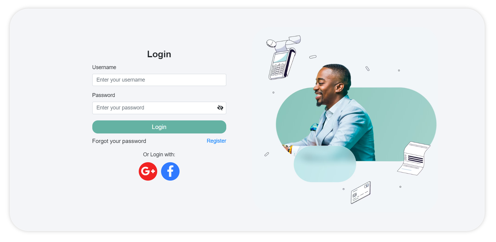

- Main page
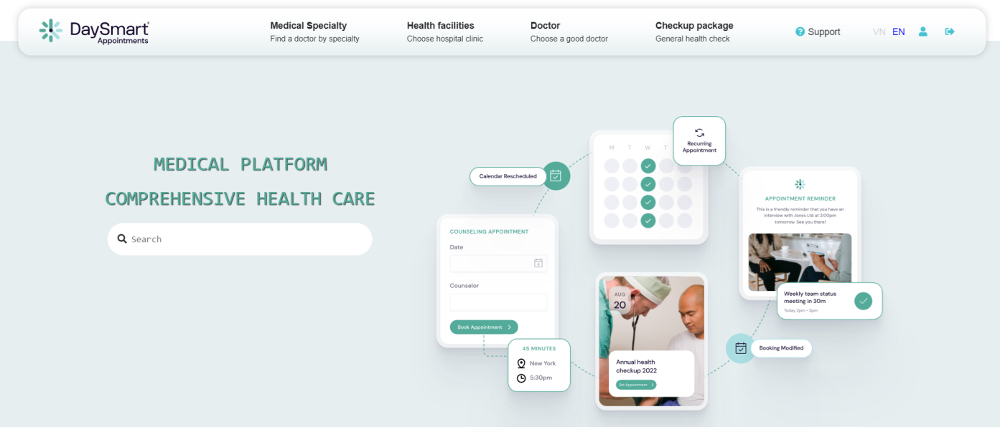
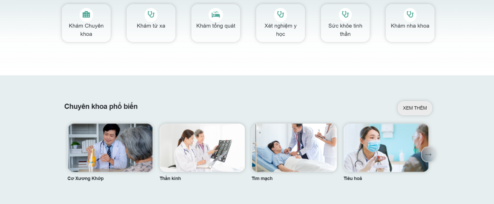

- Specialty Detail
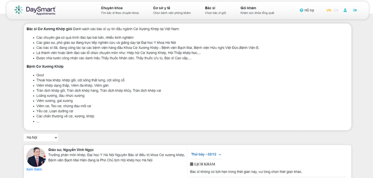

- Doctor Detail
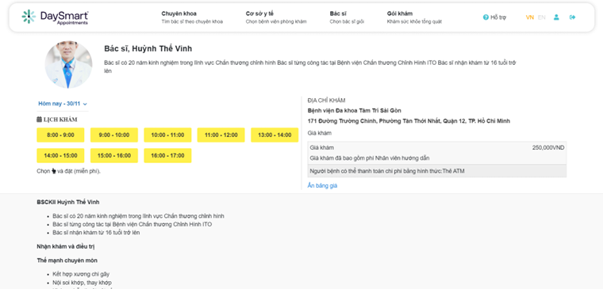

- History
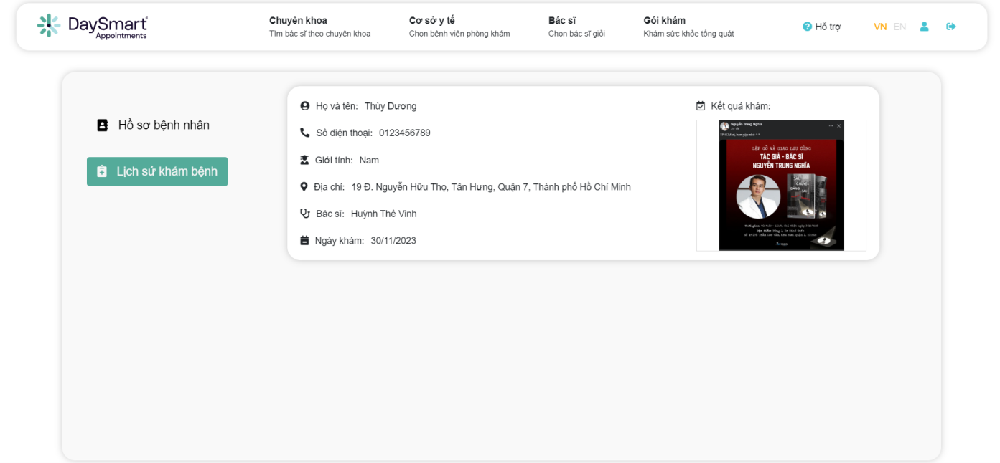

- Record
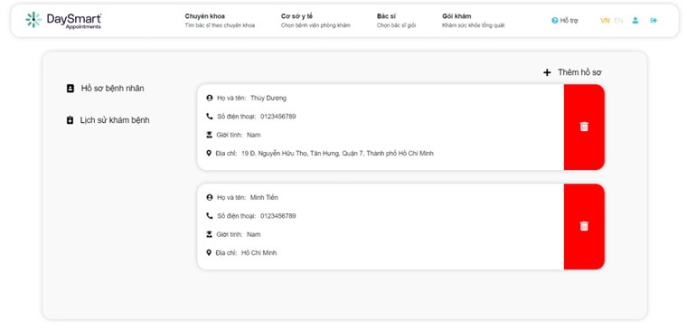

- Booking
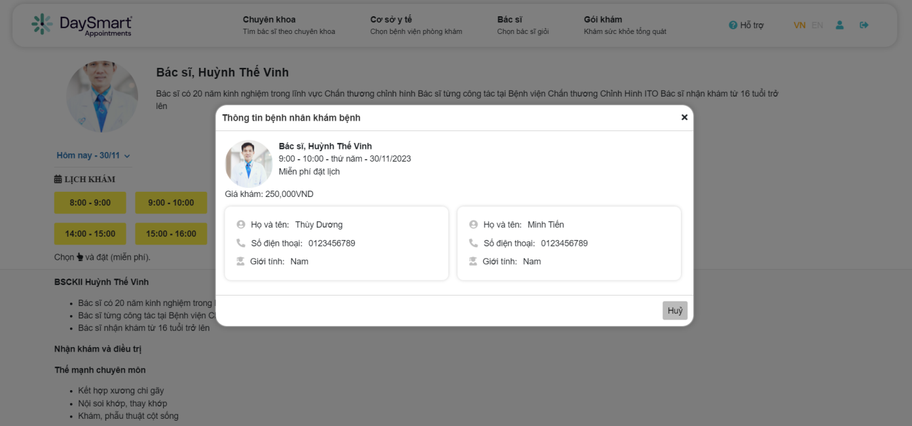

- Result
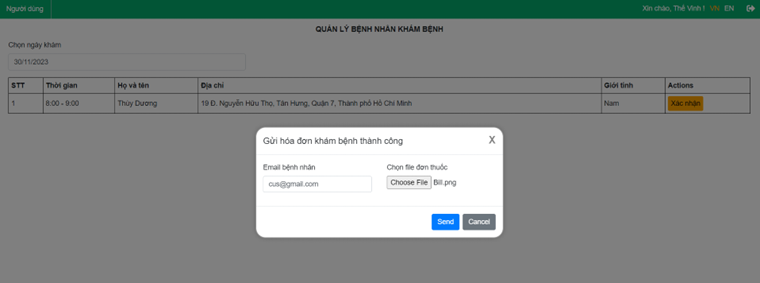

- Doctor Management
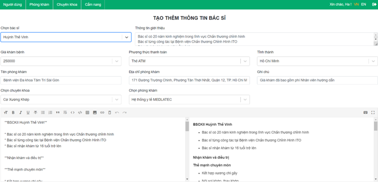

- Patient Management
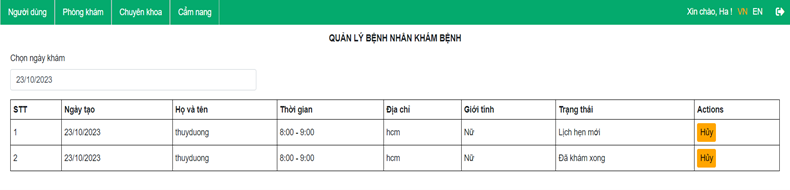

